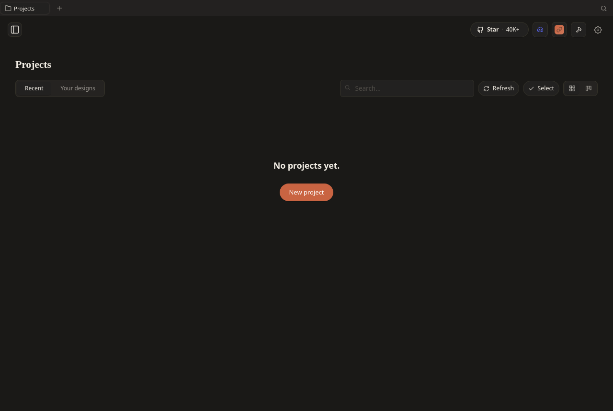

# Spike: Static export reality in real WebKitGTK (CP1-Task1)

**Question (Open Q#1):** does the upstream Next.js frontend's **static export** (`out/`)
actually render, hydrate, and route inside the **real WebKitGTK engine Tauri v2 uses on
Linux** — or do we need to fall back to a Next.js `standalone` server as a second sidecar?

**Verdict: ship the static export. `standalone` is not needed.** All hard checks pass in
WebKitGTK 2.52.3 (= the `libwebkit2gtk-4.1` engine Tauri links). The app is a pure client
SPA with no SSR data needs, so a Node SSR server would add a process + packaging weight for
zero benefit. This confirms the plan's working assumption and the CP6 bundle shape (ship
`out/` via the asset protocol). It does, however, impose **three hard requirements on the
CP2 axum serving layer** (below) — the export does not "just work" off a naive file server.

**Environment:** Ubuntu 24.04, WebKitGTK **2.52.3** (`webkit2gtk-4.1`), `DISPLAY=:0`
(headed, no Xvfb). `out/` = the CP0 build (`next build`, Next 16.2.6, `output: 'export'`,
`trailingSlash: true`, `images.unoptimized`). Reproduce with
[`static-export/probe.py`](./static-export/probe.py) (see "How to reproduce").

> Env note: this box's shell is a VS Code **snap** sandbox; its `GTK_PATH` / `GIO_MODULE_DIR`
> / `LOCPATH` / `GDK_PIXBUF_*` point into `/snap/code/...` and crash a real GTK process
> (`__libc_pthread_init … GLIBC_PRIVATE`). The probe must be run under a **sanitized env**
> (`env -i` + only `DISPLAY`/`XAUTHORITY`/`XDG_RUNTIME_DIR`/`HOME`/`PATH`). CI (CP7) and the
> packaged app are unaffected, but any local WebKitGTK spike needs this.

## Results — all checks pass

Probe loads `out/` over a loopback HTTP server (mimicking the CP2 axum contract), injects a
console/error capture script at document-start, waits for hydration, then probes render +
hydration + client routing and grabs a screenshot.

| Check | Result | Evidence |
|---|---|---|
| **Render** (styled, non-empty DOM) | ✅ | `bodyChildren: 11`, `3` stylesheets, `19` scripts; title `Open Design` |
| **Assets resolve** (`/_next/*` from origin root) | ✅ | all chunks 200; no asset 404s |
| **Hydration** (React commit, listeners attached) | ✅ | `reactFiber: true`, `7` interactive controls, `next-route-announcer` present |
| **No hydration mismatch** | ✅ | zero `console.error` matching `hydrat\|did not match\|#418/#423/#425` |
| **Client-side routing** (history API, no reload) | ✅ | `pushState('/projects')` → renders Projects view; capture mark survived (no document reload) |
| **Deep-link hard-load** (`/projects` as entry URL) | ✅ | served via SPA fallback → hydrates identically |
| **No uncaught errors** | ✅ | `window.onerror` + `unhandledrejection` empty |

Rendered output (final state after client-routing to `/projects`, with stubbed empty `/api`):



## Findings (these drive CP2/CP3 wiring)

1. **The app is a pure client SPA.** The only route emitted as HTML on disk is:
   `["/", "/404", "/_not-found", "/desktop-pet"]`. Every real app view (`/onboarding`,
   `/projects`, `/settings`, workspace, …) is rendered client-side from the `[[...slug]]`
   catch-all in `app/[[...slug]]/`. On first load the SPA client-redirects `/` → `/onboarding`.

2. **All API calls are origin-relative `/api/*`** (`fetch('/api/projects')`, etc. in
   `src/state/*`, `src/hooks/*`) — **no** build-time base URL, no `NEXT_PUBLIC_*` env. This
   pre-answers **CP1-Task2 (API-base wiring)**: the frontend reaches whatever origin serves
   it. Under the locked "axum from day one" topology that origin **is** axum, so `/api/*`
   lands on the route table with zero frontend changes. No rebuild-per-environment needed.

3. **Assets are absolute (`/_next/...`).** `file://` serving is impossible — the export
   **must** be served from an HTTP origin root. Matches the asset-protocol/axum plan.

4. **An `EventSource` (SSE) opens during boot.** The probe's JSON `/api` stub produced the
   only console error — `EventSource's response has a MIME type ("application/json") that is
   not "text/event-stream"`. Not a static-export problem (a stub artifact), but it confirms
   the SSE seam fires on startup and reinforces the **CP2 highest-risk task**: the axum proxy
   must preserve `text/event-stream` and stream unbuffered. Tracked there.

## Hard requirements this imposes on the CP2 axum serving layer

The static export is correct, but a naive static file server breaks it. axum (CP2) **must**:

- **R1 — SPA fallback.** Any non-asset path that isn't one of the 4 on-disk routes →
  serve `out/index.html` (so deep links + the `/` → `/onboarding` redirect target resolve).
  Without this, every deep route 404s. *(The probe's server replicates exactly this.)*
- **R2 — Serve from origin root** so `/_next/*` resolves; honor `trailingSlash: true` for the
  few real directory routes (each has its own `index.html`).
- **R3 — Preserve SSE.** `/api/*` responses that are `text/event-stream` must pass through
  with content-type intact and **no buffering / no compression** (already the CP2 SSE task).

## Why static over `standalone`

| | Static export (`out/`) — **chosen** | `standalone` (Next SSR server) |
|---|---|---|
| Extra process | none (served by axum) | a 2nd Node sidecar to supervise |
| Packaging | ship `out/` (~51 M) as a resource | ship traced server + `node_modules` |
| SSR benefit | n/a — app fetches all data client-side from `/api` | none realized (no server data deps) |
| V2 seam | clean: axum owns static + route table | axum must also proxy the Next server |

`standalone` exists upstream only for their hosted/server deployments
(`OD_WEB_OUTPUT_MODE=server|standalone`); it buys us nothing and costs a process. Keep the
default static path. The `next start` second-sidecar fallback named in `CLAUDE.md` is
**not** needed.

## How to reproduce

```bash
# from repo root; sanitized env is mandatory on the snap-sandboxed shell (see env note)
env -i HOME=$HOME PATH=/usr/local/bin:/usr/bin:/bin \
    DISPLAY=:0 XAUTHORITY=$XAUTHORITY XDG_RUNTIME_DIR=$XDG_RUNTIME_DIR \
    GDK_BACKEND=x11 XDG_DATA_DIRS=/usr/local/share:/usr/share \
  python3 docs/spikes/static-export/probe.py vendor/open-design/apps/web/out /
# optional 2nd arg = deep-link entry path to hard-load (e.g. /projects); writes render.png
```

The probe prints a JSON block between `PROBE_RESULTS_JSON_BEGIN/END`; exit 0 iff every hard
check passes. It uses `WebKit2 4.1` (Tauri's engine), not the newer `WebKit 6.0`. Screenshot
uses a `GdkPixbuf` window grab — the `get_snapshot` cairo path needs `python3-gi-cairo`
(absent here; only relevant to the separate WebKitGTK-render spike, which wants full snapshots).

## Implications for the roadmap

- **CP2:** implement R1–R3 in the axum static handler + proxy. R1 (SPA fallback) and R3 (SSE)
  are not optional.
- **CP1-Task2 (API-base wiring):** effectively answered — relative `/api`, no build-time var.
  Confirm only that no `NEXT_PUBLIC_*` sneaks in on a submodule bump.
- **CP6:** bundle `out/` as-is (~51 M) as a Tauri resource; no Next runtime ships.
- **ARCHITECTURE.md:** "Frontend static-exports by default" upgraded from _assumption_ to
  _verified in the real engine_.
