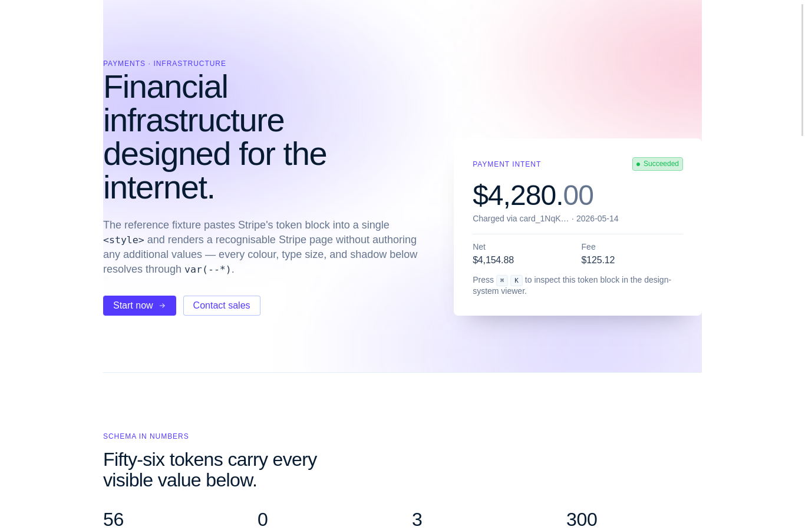
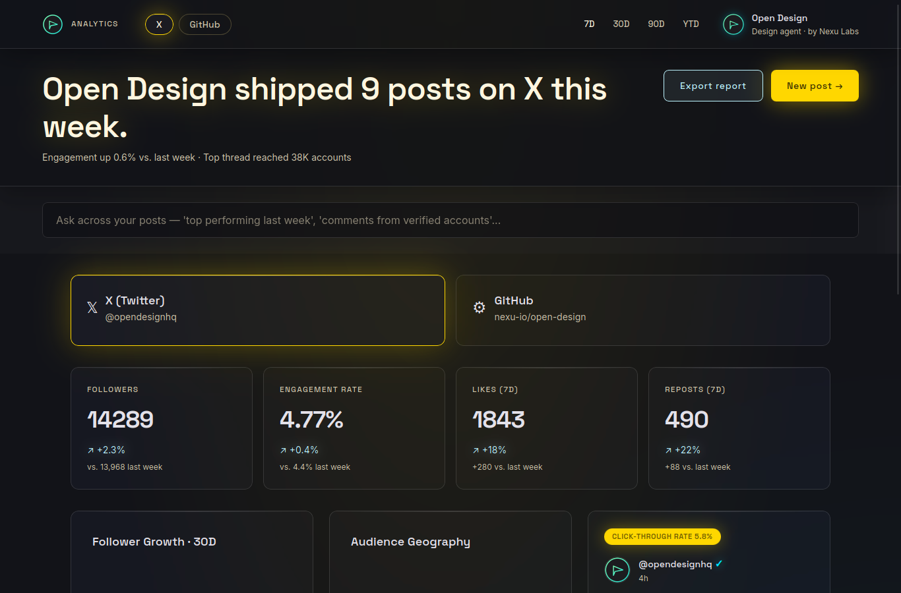
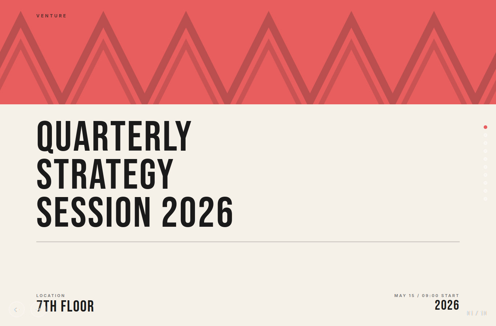
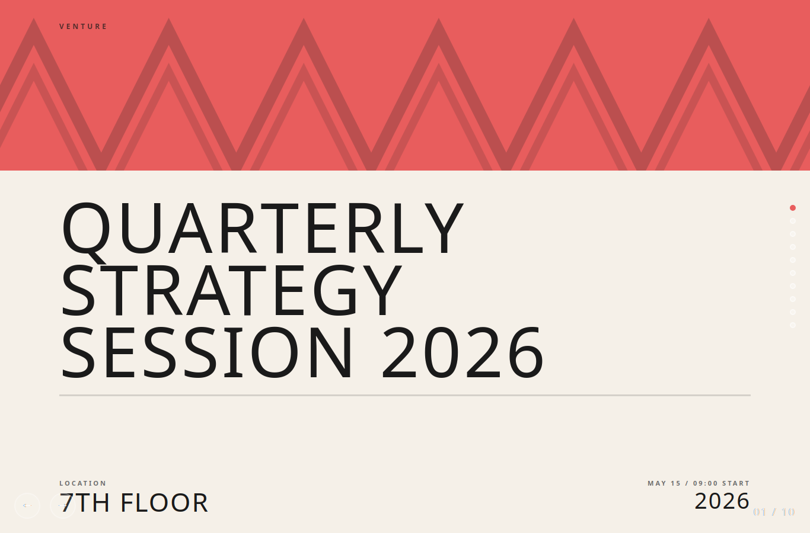

# Spike: WebKitGTK render fidelity of showcase artifacts (CP1-Task5)

**Question (CLAUDE.md gotcha #3):** Open Design's artifacts are HTML/CSS/JS authored and tested
against **Chromium-class** engines. Do a representative set of **showcase artifacts** render
correctly in the **real WebKitGTK engine Tauri v2 uses on Linux**, or do modern CSS / WebGL hero
backgrounds break? Produce a screenshot set and a triaged **known-render-issues** list.

**Verdict: engine fidelity is excellent — 6/6 render correctly online; the only real risk is
network, not the engine.** In WebKitGTK **2.52.3** (the `webkit2gtk-4.1` engine Tauri links),
every modern CSS feature the corpus uses is supported and every artifact renders cleanly (no
missing CSS, no JS errors, WebGL2 + canvas-2D both work). The "modern CSS may render differently"
fear is **not borne out** at the capability level. The genuine issue is that many artifacts pull
**fonts and JS libraries from the network** (Google Fonts, Three.js/Tailwind CDNs): **offline**,
typography silently falls back to system fonts and CDN-delivered WebGL scenes break. That is a
packaging/network concern, tracked as **KI-1**, not an engine defect.

**Environment:** Ubuntu 24.04, WebKitGTK **2.52.3** (`WebKit2 4.1`, hardware-accel ALWAYS, WebGL
enabled), `DISPLAY=:0` (headed). Six artifacts chosen from the 837-file HTML corpus to maximize
risky-feature coverage. Harness:
[`webkitgtk-render/render_probe.py`](./webkitgtk-render/render_probe.py) — run under the sanitized
env (snap-sandbox note in [static-export.md](./static-export.md)); offline mode adds a dead proxy
inside a `unshare -rn` net namespace with a cold cache.

## The showcase set (deliberately stressful)

| slug | artifact | stresses | online | offline |
|---|---|---|---|---|
| `stripe-ds` | `design-systems/stripe/components.html` | color-mix + grid (design-system baseline) | ✅ | ✅ |
| `zhangzara-coral` | `design-templates/html-ppt-zhangzara-coral/example.html` | **WebGL/Three.js** hero + canvas | ✅ | ❌ (CDN) |
| `social-glass` | `design-templates/social-media-dashboard/example.html` | **backdrop-filter** glassmorphism | ✅ | ✅ |
| `8bit-orbit` | `design-templates/html-ppt-zhangzara-8-bit-orbit/example.html` | clip-path + mask-image + mix-blend-mode | ✅ | ✅ |
| `crypto-dash` | `design-templates/live-artifact/examples/crypto-dashboard.html` | **Google Fonts** + heavy dashboard | ✅ | ✅ (font drift) |
| `matrix-canvas` | `design-templates/social-media-matrix-tracker-template/example.html` | **canvas 2D** charts | ✅ | ✅ |

Hard checks per artifact: render-nonblank (`scrollH>200`, text>30), no-uncaught-JS, and
`CSS.supports()` for color-mix / clip-path / aspect-ratio / conic-gradient / mix-blend-mode.

## Results

**Online (network available): 6 / 6 pass.** **Offline (cold cache, no network): 5 / 6 pass** — only
the Three.js-from-CDN slide throws (its library 404s). Across all six, online: **zero** console
errors, **zero** uncaught JS, **zero** failed local resources.

### CSS feature support in WebKitGTK 2.52.3 — all green
`CSS.supports()` returned **true** for every feature the corpus uses, on every artifact:

| color-mix | backdrop-filter | clip-path | mask-image | mix-blend-mode | aspect-ratio | `:has()` | container queries | conic-gradient | CSS nesting |
|:-:|:-:|:-:|:-:|:-:|:-:|:-:|:-:|:-:|:-:|
| ✅ | ✅ | ✅ | ✅ | ✅ | ✅ | ✅ | ✅ | ✅ | ✅ |

WebGL: `WebGL2RenderingContext` available on every load. Canvas-2D: 7 canvases render in
`matrix-canvas`. (color-mix is used by **175** corpus files, grid by **604** — the common baseline
— and both render correctly.)

### Screenshots (rendered in WebKitGTK 2.52.3)

Design-system baseline — gradient hero, glass card, token table (`stripe-ds`):



Backdrop-filter glassmorphism, dark theme, glow-border card (`social-glass`):



**The KI-1 money shot — same WebGL slide, online vs offline.** Online (webfont + CDN libs load)
vs offline (webfont 404s → generic sans-serif; note the wider, lighter display type; the CSS
zigzag hero itself still renders):

| online | offline (no network) |
|---|---|
|  |  |

## Known-render-issues list (the deliverable)

- **KI-1 — External network dependencies (HIGH; packaging, *not* engine).** Many artifacts fetch
  assets at runtime:
  - **Google Fonts** — referenced by **142** corpus files; **zero use `@font-face`** (all webfonts
    are external `<link>`s). Offline → silent fallback to the CSS system stack → **visible
    typography drift** (above), layout otherwise intact.
  - **Three.js (`cdn.jsdelivr.net`, ~17 files) / Tailwind CDN (`cdn.tailwindcss.com`, 24 files)** —
    offline the `<script>` 404s → broken animated/WebGL backgrounds **and an uncaught
    `ReferenceError`** (this is what failed `zhangzara-coral` offline). The CLAUDE.md "WebGL hero"
    gotcha is really a **CDN-delivery** gotcha: WebGL2 itself works.
  - **Other external hosts** seen: `github.com`/`avatars.githubusercontent.com` (avatars),
    exchange/market sites (live data demos).
  - *Mitigation:* the packaged webview should keep network access (users are normally online) and
    we **document** that fully-offline use degrades typography and breaks CDN-WebGL slides. For V1
    acceptance, online fidelity is 6/6. A later option is a serve-time asset-vendoring pass
    (self-host fonts + pin Three.js/Tailwind locally); artifacts are upstream read-only, so do it
    at the serving layer, not by editing content.
- **KI-2 — Modern CSS (NONE; engine fidelity is excellent).** No feature the corpus uses is
  missing or visibly broken in WebKitGTK 2.52.3. We did **not** pixel-diff against Chromium, so
  sub-pixel font-rendering/gradient-banding differences are possible, but there are **no capability
  gaps and no layout breakage**. The blanket "may render differently" caution can be downgraded.
- **KI-3 — WebGL2 / canvas-2D (NONE; engine).** Both work; the only failures trace to KI-1 library
  delivery.
- **KI-4 — GStreamer/HW-accel noise (MINOR).** A `gst-plugin-scanner` CRITICAL (DMA format
  assertion) prints to stderr under hardware-accel; harmless here (no video played), but the **2
  artifacts with `<video>`** mean CP6 should ensure the `.deb`/AppImage pulls the GStreamer plugin
  set so video artifacts and any WebRTC/`<video>` content play. Not a render blocker.

**Positive structural finding:** template artifacts ship a **`localStorage`/`sessionStorage` shim**
(defends against sandboxed contexts where storage throws) — so they tolerate a restricted webview.

## V1 acceptance

Satisfies the done-criterion **"≥5 showcase skills render correctly in WebKitGTK"** — **6/6
online**, spanning design-system components, slide decks, glassmorphism dashboards, pixel-art
compositing, canvas charts, and a WebGL hero. Re-run as a regression gate on submodule bumps and in
CP6 against the *bundled* WebKitGTK.

## How to reproduce

```bash
# online (best-case engine fidelity)
env -i HOME=$HOME PATH=/usr/local/bin:/usr/bin:/bin DISPLAY=$DISPLAY \
    XAUTHORITY=$XAUTHORITY XDG_RUNTIME_DIR=$XDG_RUNTIME_DIR GDK_BACKEND=x11 \
    XDG_DATA_DIRS=/usr/local/share:/usr/share \
  python3 docs/spikes/webkitgtk-render/render_probe.py vendor/open-design

# true offline (cold cache, loopback-only net namespace) — characterizes degradation
COLD=$(mktemp -d); unshare -rn sh -c "ip link set lo up; exec env -i HOME=$COLD \
  PATH=/usr/local/bin:/usr/bin:/bin DISPLAY=$DISPLAY XAUTHORITY=$XAUTHORITY \
  XDG_RUNTIME_DIR=$XDG_RUNTIME_DIR GDK_BACKEND=x11 XDG_DATA_DIRS=/usr/local/share:/usr/share \
  python3 docs/spikes/webkitgtk-render/render_probe.py vendor/open-design --offline"
```

Prints a JSON block between `RENDER_RESULTS_JSON_BEGIN/END`; writes `render-<slug>[-offline].png`.
Exit 0 iff every artifact clears the hard checks.

## Implications for the roadmap
- **CP1-Task5:** answered — WebKitGTK 2.52.3 renders the showcase corpus faithfully (6/6 online);
  modern-CSS/WebGL caution downgraded; the real risk is external fonts/CDN libs offline (KI-1).
- **CP6:** ensure the bundled webview keeps network access; pull the GStreamer plugin set (KI-4);
  consider a serve-time font/CDN-vendoring pass for offline-grade fidelity; re-run this probe
  against the bundled WebKitGTK.
- **CONTRACT/serving (CP2):** none — artifacts render from a plain origin; the `localStorage` shim
  means storage sandboxing is already handled by the content.
- **ARCHITECTURE.md:** "artifacts render in WebKitGTK" upgraded from _assumption_ to _verified, with
  a known-issues list (external-resource offline degradation)_.
